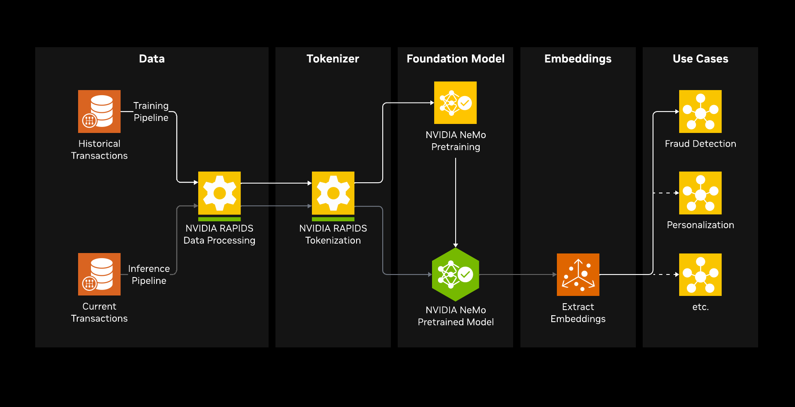

<h2> NVIDIA Developer Example: Build Your Own Transaction Foundation Model</h2>

Financial transaction data is one of the richest signals available in the enterprise. Every swipe, transfer, and payment encodes patterns of human behavior — from daily spending habits to subtle shifts that precede fraud. Traditional approaches rely on hand-crafted features and rules that are brittle, slow to adapt, and blind to the deep sequential structure in transaction histories. Foundation models change this equation: by pretraining on large volumes of unlabeled transaction sequences, they learn general-purpose representations of financial behavior that transfer to a wide range of downstream tasks — fraud detection, anomaly scoring, customer segmentation, and personalized financial services.

This developer example shows how to build such a model end-to-end on NVIDIA GPUs:

- **Custom GPU-accelerated tokenizer** — A modular, RAPIDS-powered tokenizer converts heterogeneous tabular fields (merchant category, amount, time deltas, and more) into domain-specific token sequences. The pipeline is designed to be flexible: swap or add tokenizer components to match any transaction schema.
- **Scalable pretraining with NeMo AutoModel** — A decoder-only foundation model is trained with causal language modeling through NVIDIA NeMo AutoModel. NeMo AutoModel handles distributed training out of the box, scaling seamlessly from a single GPU to multi-node clusters, and can incorporate essentially any HuggingFace-compatible decoder architecture. This example uses Llama, but the framework is architecture-agnostic.
- **Embedding extraction and downstream evaluation** — Learned embeddings are extracted via last-token pooling and evaluated on fraud detection with XGBoost, demonstrating clear lift over hand-crafted feature baselines.



#### Software Components

##### NVIDIA Technology

- **NVIDIA NeMo AutoModel** — Foundation model training and inference
- **NVIDIA RAPIDS (cuDF, cuML)** — GPU-accelerated data processing and tokenization

##### 3rd Party Software

- **PyTorch 2.x** — Deep learning framework
- **HuggingFace Transformers** — Model checkpointing and loading
- **XGBoost** — Gradient-boosted trees for fraud detection
- **scikit-learn** — Classical ML preprocessing, metrics, and baseline utilities
- **pandas** — CPU dataframe operations and interoperability with GPU pipelines
- **NumPy** — Array operations used across preprocessing and inference
- **CuPy** — GPU array operations for tokenizer and embedding workflows
- **matplotlib** — Static visualizations
- **seaborn** — Statistical plotting for dataset exploration
- **plotly** — Interactive 3D embedding visualization
- **tqdm** — Progress bars in notebook inference workflows
- **ipywidgets** — Notebook widget support
- **torchdata** — Stateful data loading for model training

> **Third-Party Software Notice**
> This project will download and install additional third-party open source software projects.
> Please review the license terms of these open source projects before use.

## Table of Contents

- [Quickstart](#quickstart)
  - [Notebooks](#notebooks)
- [Deployment](#deployment)
  - [Prerequisites](#prerequisites)
  - [Steps](#steps)
- [Customization](#customization)
- [Model Architecture](#model-architecture)
- [License](#license)

---

### Quickstart

#### Notebooks

| # | Notebook | Description |
|---|----------|-------------|
| 1 | `01_dataset_baseline.ipynb` | Load the TabFormer financial transaction dataset, create temporal train/val/test splits, and train a GPU-accelerated XGBoost baseline for fraud detection. |
| 2 | `02_seq_preproc_tokenization.ipynb` | Build a custom GPU-accelerated tokenizer pipeline that converts transaction records into domain-specific token sequences. |
| 3 | `03_foundation_model_training.ipynb` | Pretrain a decoder-only foundation model (\~29M parameters) on tokenized transaction sequences using NeMo AutoModel with causal language modeling. |
| 4 | `04_inference_embedding_extraction.ipynb` | Load the pretrained model, run GPU inference, extract 512-dimensional embeddings via last-token pooling, and visualize with UMAP. |
| 5 | `05_xgboost_fraud_detection.ipynb` | Compare XGBoost fraud detection using raw features, foundation model embeddings, and combined features. |

1. Pull and launch the [NeMo Framework container](https://catalog.ngc.nvidia.com/orgs/nvidia/containers/nemo) (25.09.01+) with GPU access and port mapping:
   ```bash
   docker run --gpus all --rm -it \
     -v $(pwd):/workspace \
     --shm-size=8g \
     -p 8888:8888 \
     --ulimit memlock=-1 \
     nvcr.io/nvidia/nemo:25.09.01
   ```
   - `--shm-size=8g` — increases shared memory to prevent DataLoader crashes under PyTorch multi-process loading
   - `-p 8888:8888` — publishes the Jupyter port to the host browser
   - `--ulimit memlock=-1` — removes the locked-memory limit required by some CUDA operations
2. Inside the container, install Git LFS, fetch the checkpoint artifacts, and start Jupyter:
   ```bash
   git config --global --add safe.directory /workspace
   apt-get update && apt-get install -y git-lfs
   git lfs install
   git lfs pull
   jupyter notebook --ip=0.0.0.0 --port=8888 --no-browser --allow-root
   ```
   > **Note:** The `safe.directory` line is required because the repository is bind-mounted from the host, which causes a Git ownership mismatch inside the container. Without it, `git lfs pull` will fail.

   Each notebook installs its own dependencies (e.g. `%pip install xgboost ...`) so a separate `requirements.txt` is not needed.

   Open `http://localhost:8888/?token=...` in your browser.
3. Run `01_dataset_baseline.ipynb` to download the dataset and establish an XGBoost baseline.
4. Continue through notebooks 02\–05 sequentially.

**Pre-trained Model Checkpoint (required for notebooks 04\–05)**

Notebooks 04 and 05 load the pre-trained checkpoint from `models/decoder-foundation-model/`. This checkpoint (\~56 MB) is tracked with Git LFS and was trained for \~3,000 steps on 8× A100 GPUs. You **must** run `git lfs pull` (step 2 above) to download it.

Notebook 03 runs a short 30-step demo to illustrate the training pipeline; its output is saved to a separate directory (`models/decoder-demo/`) and is **not** used by notebooks 04\–05. Whether you run notebook 03 or skip it, the pre-trained checkpoint from Git LFS is what notebooks 04 and 05 expect.

---

### Deployment

#### Prerequisites

| Component | Requirement |
|-----------|-------------|
| GPU | 1× NVIDIA A100 (80 GB) or H100 |
| System RAM | 32 GB |
| OS | Ubuntu 22.04+ |
| CUDA | CUDA 12 (provided via the NeMo Framework container) |
| Container | [NeMo Framework](https://catalog.ngc.nvidia.com/orgs/nvidia/containers/nemo) 25.09.01+ |
| Python | 3.10+ |

#### Steps

1. Pull the NeMo container:
   ```bash
   docker pull nvcr.io/nvidia/nemo:25.09.01
   ```
2. Launch with GPU access, mount this repository, and publish the Jupyter port:
   ```bash
   docker run --gpus all --rm -it \
     -v $(pwd):/workspace \
     --shm-size=8g \
     -p 8888:8888 \
     --ulimit memlock=-1 \
     nvcr.io/nvidia/nemo:25.09.01
   ```
   > **Remote host**: If running on a remote machine, add SSH port forwarding (`ssh -L 8888:localhost:8888 user@host`) so Jupyter is reachable from your local browser.
3. Install Git LFS and pull the pre-trained checkpoint:
   ```bash
   git config --global --add safe.directory /workspace
   apt-get update && apt-get install -y git-lfs
   git lfs install
   git lfs pull
   ```
   > **Note:** The `safe.directory` line is needed because bind-mounting the repo causes a Git ownership mismatch inside the container.

   Each notebook installs its own dependencies inline, so no separate `requirements.txt` is needed.
4. Start Jupyter inside the container:
   ```bash
   jupyter notebook --ip=0.0.0.0 --port=8888 --no-browser --allow-root
   ```
   Open the URL printed in the terminal (e.g. `http://localhost:8888/?token=...`) in your browser.
5. Run notebooks 01\–05 sequentially. Notebooks 04 and 05 require the pre-trained checkpoint downloaded by `git lfs pull` in step 3 (see [Pre-trained Model Checkpoint](#quickstart) above).

---

### Customization

The developer example is designed for extensibility:

- **Tokenizer** — The modular tokenizer pipeline (`src/tokenizer/`) can be adapted to different transaction schemas by adding or replacing individual tokenizer components.
- **Model Architecture** — Training hyperparameters and model configuration are in `configs/pretrain_financial_decoder.yaml`. Swap in any HuggingFace-compatible decoder architecture by updating this config.
- **Downstream Tasks** — Replace XGBoost with any classifier that accepts fixed-length feature vectors.

---

### Model Architecture

The included example uses a Llama decoder architecture, but NeMo AutoModel supports any HuggingFace-compatible decoder model.

| Parameter | Value |
|-----------|-------|
| Architecture | Llama (decoder-only transformer) |
| Parameters | \~29M |
| Hidden size | 512 |
| Layers | 8 |
| Attention | Grouped Query Attention (8 query heads, 2 KV heads) |
| Context window | 8,192 tokens (RoPE) |
| Activation | SwiGLU |
| Normalization | RMSNorm |
| Vocabulary | \~6,251 domain-specific tokens |

---

### License

By using this software, you are agreeing to the terms and conditions of the license and acceptable use policy.

**GOVERNING TERMS**: This developer example is governed by the [NVIDIA Software License Agreement](https://www.nvidia.com/en-us/agreements/enterprise-software/nvidia-software-license-agreement/) and [Product Specific Terms for AI Products](https://www.nvidia.com/en-us/agreements/enterprise-software/product-specific-terms-for-ai-products/).

This project will download and install additional third-party open source software projects. Review the license terms of these open source projects before use.

Please report security vulnerabilities or NVIDIA AI concerns [here](https://www.nvidia.com/en-us/support/submit-security-vulnerability/).
